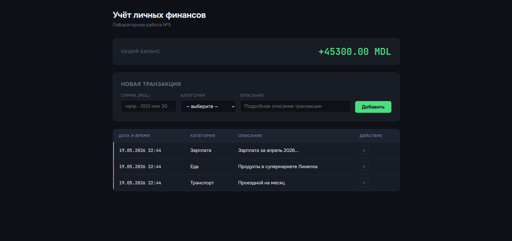

# Цель работы

### 1.1. Вывод массива в консоль
Функция предназначена для вывода элементов массива в консоль.
Она принимает массив в качестве входного параметра и выводит каждый элемент с указанием его индекса в формате:
Element index: value.

Функция не возвращает значение (тип возвращаемого значения — void).


  ```JavaScript
function printArray(array) {
  for (let i = 0; i < array.length; i++) {
    console.log(`Element ${i}: value ${array[i]}`);
  }
}

function printArray1(array) {
  for (let i = 0; i < array.length; i++) {
    console.log(`${i}: ${array[i]}`);
  }
}
```

### 1.2. Функция forEach(array, callback)
Функция реализует перебор массива с использованием колбэк-функции.
Принимает два аргумента:

массив,
функцию обратного вызова (callback).

Для каждого элемента массива вызывается callback, которому передаются:

текущий элемент,
индекс элемента,
исходный массив.


```Javascript
function forEach(array, callback) {
  for (let i = 0; i < array.length; i++) {
    callback(array[i], i, array);
  }
}

function map(array, callback) {
  const result = [];
  for (let i = 0; i < array.length; i++) {
    result.push(callback(array[i], i, array));
  }
  return result;
```
### 2. Функция map(array, callback)
Функция предназначена для преобразования массива.
Принимает массив и функцию callback, которая применяется к каждому элементу.

Возвращает новый массив, содержащий результаты выполнения callback для каждого элемента исходного массива.
Длина нового массива совпадает с длиной исходного.


  ```Javascript
function map(array, callback) {
  const result = [];
  for (let i = 0; i < array.length; i++) {
    result.push(callback(array[i], i, array));
  }
  return result;
}
  ```
### 3. Функция filter(array, callback)
Функция используется для фильтрации элементов массива по заданному условию.
Принимает массив и callback-функцию, которая возвращает true или false.

Возвращает новый массив, содержащий только те элементы, для которых callback вернул true.


  ```JavaScript
function filter(array, callback) {
  const result = [];
  for (let i = 0; i < array.length; i++) {
    if (callback(array[i], i, array)) {
      result.push(array[i]);
    }
  }
  return result;
}
  ```
### 4. Функция find(array, callback)
Функция предназначена для поиска элемента в массиве.
Принимает массив и callback-функцию.

Возвращает первый элемент, для которого callback возвращает true.
Если такой элемент отсутствует, возвращается undefined.


  ```JavaScript
function find(array, callback) {
  for (let i = 0; i < array.length; i++) {
    if (callback(array[i], i, array)) {
      return array[i];
    }
  }
}
  ```
### 5. Функция some(array, callback)
Функция some

Функция проверяет, существует ли хотя бы один элемент массива, удовлетворяющий условию.

Принимает массив и callback-функцию.
Возвращает:

true, если найден хотя бы один подходящий элемент,
false — если ни один элемент не соответствует условию.


  ```JavaScript
function some(array, callback) {
  for (let i = 0; i < array.length; i++) {
    if (callback(array[i], i, array)) {
      return true;
    }
  }
  return false;
}
  ```
### 6. Функция every(array, callback)
Функция проверяет, удовлетворяют ли все элементы массива заданному условию.

Принимает массив и callback-функцию.
Возвращает:

true, если все элементы соответствуют условию,
false — если хотя бы один элемент не соответствует.


  ```JavaScript
function every(array, callback) {
  for (let i = 0; i < array.length; i++) {
    if (!callback(array[i], i, array)) {
      return false;
    }
  }
  return true;
}
  ```
### 7. Функция reduce(array, callback, initialValue)
Функция reduce

Функция предназначена для последовательной обработки элементов массива с накоплением результата.

Принимает:

массив,
callback-функцию,
начальное значение аккумулятора (необязательно).

Возвращает одно итоговое значение, полученное в результате обработки всех элементов массива.


  ```Javascript
function reduce(array, callback, initialValue) {
  let acc = initialValue;
  let start = 0;

  if (acc === undefined) {
    acc = array[0];
    start = 1;
  }

  for (let i = start; i < array.length; i++) {
    acc = callback(acc, array[i], i, array);
  }

  return acc;
}
  ```
# 1. Преимущества использования колбэков при работе с массивами
Использование колбэк-функций при работе с массивами имеет несколько важных преимуществ:

Универсальность кода — одна и та же функция (например, обработчик массива) может использоваться для разных задач, меняется только логика в колбэке.
Переиспользуемость — нет необходимости писать отдельные функции под каждую операцию.
Сокращение дублирования кода — уменьшается количество повторяющегося кода.
Повышение читаемости — логика обработки отделяется от механизма обхода массива.
Гибкость — можно легко менять поведение функции без её переписывания.

# 2. Какие проблемы могут возникать при использовании колбэков и как их избежать
При использовании колбэков могут возникать следующие проблемы:
a.Сложность понимания кода
b.Ошибки типов
c.Сложность отладки
d.Потеря контроля над логикой

# Как реализовать map, filter, find, some, every и reduce без встроенных методов массивов
## 1. map
Создаёт новый массив, применяя колбэк к каждому элементу:
создаётся пустой массив
каждый элемент преобразуется через callback
результат добавляется через push

## 2. filter
Отбирает элементы по условию:

создаётся пустой массив
если callback возвращает true, элемент добавляется

## 3. find

Ищет первый подходящий элемент:

проходит по массиву
возвращает первый элемент, где callback = true
если не найден — undefined

## 4. some
Проверяет наличие хотя бы одного подходящего элемента:

если найден элемент с true → сразу возвращает true
если нет → false

## 5. every
Проверяет, подходят ли все элементы:

если хотя бы один элемент не подходит → возвращает false
иначе → true

## 6. reduce
Используется для накопления результата:
создаётся аккумулятор
каждый элемент изменяет аккумулятор через callback
возвращается итоговое значение


