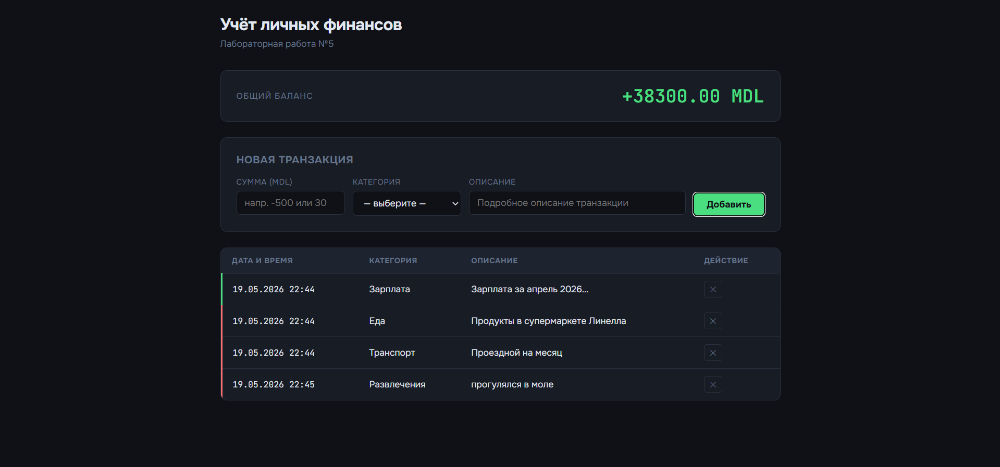

#  Лабораторная работа №4 Иванчогло Иван(IA2504)
---

## Цель работы

Познакомиться с классами и объектами в JavaScript: научиться создавать классы, использовать конструкторы и методы, а также реализовать наследование между классами. Дополнительно — освоить функции-конструкторы и оператор опциональной цепочки `?.`.

---

##  Реализация

### Шаг 1 — Класс `Item`

Базовый класс, представляющий предмет инвентаря.

| Поле | Тип | Описание |
|------|-----|----------|
| `name` | `string` | Название предмета |
| `weight` | `number` | Вес в кг |
| `rarity` | `string` | Редкость: `common` / `uncommon` / `rare` / `legendary` |

| Метод | Описание |
|-------|----------|
| `getInfo()` | Возвращает строку с описанием предмета |
| `setWeight(newWeight)` | Изменяет вес предмета |

```js
const sword = new Item("Steel Sword", 3.5, "rare");
console.log(sword.getInfo());
// [RARE] Steel Sword | Вес: 3.5 кг

sword.setWeight(4.0);
// Вес предмета "Steel Sword" изменён на 4 кг
```

---

### Шаг 2 — Класс `Weapon` (наследует `Item`)

Расширяет `Item` полями для боевого оружия.

| Поле | Тип | Описание |
|------|-----|----------|
| `damage` | `number` | Урон оружия |
| `durability` | `number` | Прочность от 0 до 100 |

| Метод | Описание |
|-------|----------|
| `getInfo()` | Возвращает полное описание (включая урон и прочность) |
| `use()` | Уменьшает прочность на 10; выводит предупреждение при 0 |
| `repair()` | Восстанавливает прочность до 100 |

```js
const bow = new Weapon("Longbow", 2.0, "uncommon", 15, 100);
console.log(bow.getInfo());
// [UNCOMMON] Longbow | Вес: 2 кг | Урон: 15 | Прочность: 100/100

bow.use();
// "Longbow" использовано. Прочность: 90/100

bow.repair();
// "Longbow" починено. Прочность: 100/100
```

---

### Шаг 3 — Тестирование классов

Протестированы следующие сценарии:

- Создание `Item` и вывод информации через `getInfo()`
- Изменение веса через `setWeight()`
- Использование `Weapon` до поломки (`durability → 0`)
- Попытка использовать сломанное оружие — вывод предупреждения
- Починка оружия через `repair()`

**Пример граничного случая:**

```js
const axe = new Weapon("Dark Axe", 5.0, "legendary", 40, 10);
axe.use(); // Прочность: 0/100
axe.use(); // "Dark Axe" сломано и не может быть использовано!
```

---

### Шаг 4 — Функции-конструкторы и опциональная цепочка

#### Функция-конструктор `ItemConstructor`

Аналог класса `Item`, написанный в стиле ES5 через `function` и `prototype`.

```js
function ItemConstructor(name, weight, rarity) {
  this.name = name;
  this.weight = weight;
  this.rarity = rarity;
}

ItemConstructor.prototype.getInfo = function () {
  return `[${this.rarity.toUpperCase()}] ${this.name} | Вес: ${this.weight} кг`;
};
```

#### Функция-конструктор `WeaponConstructor`

Наследует `ItemConstructor` через `Object.create()` и `call()`.

```js
function WeaponConstructor(name, weight, rarity, damage, durability) {
  ItemConstructor.call(this, name, weight, rarity); // вызов родителя
  this.damage = damage;
  this.durability = durability;
}

WeaponConstructor.prototype = Object.create(ItemConstructor.prototype);
WeaponConstructor.prototype.constructor = WeaponConstructor;
```

#### Опциональная цепочка `?.`

Используется для безопасного доступа к свойствам и методам, когда объект может быть `null` или `undefined`.

```js
const maybeWeapon = null;
const info = maybeWeapon?.getInfo();
// undefined — без ошибки TypeError

// Перебор массива с null-элементами
const items = [new Weapon(...), null, new Item(...)];
items.forEach(item => {
  console.log(item?.getInfo() ?? "пустой слот");
});
```

---

## Скриншоты


### Вывод результатов — Шаг 3 (классы)


### Вывод результатов — Шаг 4 (конструкторы + опциональная цепочка)


---

## ▶️ Запуск

```bash
node lab4.js
```

**Вывод в консоль:**

```
Тестирование классов

[RARE] Steel Sword | Вес: 3.5 кг
Вес предмета "Steel Sword" изменён на 4 кг
[UNCOMMON] Longbow | Вес: 2 кг | Урон: 15 | Прочность: 100/100
"Longbow" использовано. Прочность: 90/100
"Dark Axe" использовано. Прочность: 0/100
"Dark Axe" сломано и не может быть использовано!


[COMMON] Iron Dagger | Вес: 0.8 кг
[LEGENDARY] Magic Staff | Вес: 1.5 кг | Урон: 60 | Прочность: 80/100


Информация об оружии: предмет не существует
Слот 1: [UNCOMMON] Spear | Вес: 3 кг | Урон: 25 | Прочность: 50/100
Слот 2: пустой слот
Слот 3: [COMMON] Health Potion | Вес: 0.2 кг
```

---

##  Ответы на контрольные вопросы

**1. Какое значение имеет `this` в методах класса?**

`this` ссылается на конкретный экземпляр объекта, вызвавший метод. Например, при вызове `sword.getInfo()` внутри метода `this.name` равно `"Steel Sword"`. В стрелочных функциях `this` не переопределяется — берётся из внешнего лексического контекста.

---

**2. Как работает модификатор `#` в JavaScript?**

Поля с префиксом `#` являются **приватными** (private fields, ES2022): они доступны только внутри тела класса. Любая попытка обратиться к ним снаружи — `obj.#field` — вызовет `SyntaxError`. Это настоящая инкапсуляция на уровне языка, в отличие от соглашения `_field`, которое не даёт реальной защиты.

```js
class Weapon {
  #durability = 100;

  getDurability() {
    return this.#durability; //  внутри класса — ок
  }
}

const w = new Weapon();
console.log(w.#durability); //  SyntaxError
```

---

**3. В чём разница между классами и функциями-конструкторами?**

| Критерий | `class` (ES6+) | Функция-конструктор (ES5) |
|----------|----------------|--------------------------|
| Синтаксис | Современный, лаконичный | Многословный, ручная настройка |
| Hoisting | Не поднимается (TDZ) | Поднимается как функция |
| `super` | Встроен в синтаксис | Ручной вызов: `Parent.call(this)` |
| Настройка прототипа | Автоматически через `extends` | Вручную: `Object.create()` + `constructor` |
| Строгий режим | Всегда `"use strict"` | Нет по умолчанию |
| Приватные поля | Поддерживает `#` | Не поддерживает |

> Оба подхода используют прототипное наследование под капотом. `class` — это синтаксический сахар, делающий код чище и понятнее.

---

##  Вывод

В ходе лабораторной работы были изучены и реализованы:

- Создание класса с полями и методами (`Item`)
- Наследование с переопределением методов (`Weapon extends Item`)
- Документирование кода по стандарту JSDoc
- Переписывание классов через функции-конструкторы и цепочку прототипов
- Безопасный доступ к свойствам через оператор `?.` и оператор `??`
