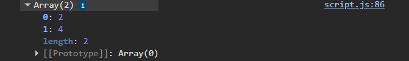
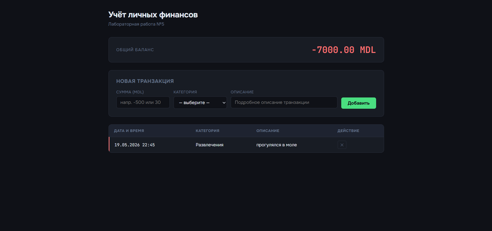

# 💰 Лабораторная работа №5 Иванчогло Иван(IA2504)


---

##  Цель работы

Ознакомиться с основами взаимодействия JavaScript с DOM-деревом на основе веб-приложения для учёта личных финансов: добавление, удаление и отображение транзакций, делегирование событий, валидация формы.

---

##  Реализация по шагам

### Шаг 1 — Структура проекта

Проект разделён на 4 модуля, подключённых через `type="module"`:

```html
<script type="module" src="src/index.js"></script>
```

Каждый модуль отвечает за свою область: `transactions.js` — данные, `ui.js` — DOM, `utils.js` — утилиты, `index.js` — склейка и события.

---

### Шаг 2 — Представление транзакции

Каждый объект транзакции имеет структуру:

```js
{
  id: "lf3k2a9x",           // уникальный ID (generateId)
  date: "19.05.2025 14:30", // форматированная дата (formatDate)
  amount: -1200,            // сумма (отрицательная = расход)
  category: "Еда",
  description: "Продукты в супермаркете Пятёрочка"
}
```

Хранится в экспортируемом массиве `transactions` в `transactions.js`.

---

### Шаг 3 — Отображение транзакций

HTML-таблица с 4 столбцами:

| Дата и время | Категория | Описание | Действие |
|---|---|---|---|
| 19.05.2025 14:30 | Еда | Продукты в супермаркете… | ✕ |

Рендеринг строк — функция `renderTransaction(transaction)` в `ui.js`.

---

### Шаг 4 — Добавление транзакций

```js
// transactions.js
export function addTransaction(amount, category, description) {
  const transaction = { id: generateId(), date: formatDate(new Date()), ... };
  transactions.push(transaction);
  return transaction;
}
```

Строка окрашивается CSS-классом: `income` (зелёная граница) или `expense` (красная граница). В колонке описания — первые 4 слова через `truncateWords()`.

---

### Шаг 5 — Удаление транзакций (делегирование событий)

Обработчик клика навешен **на таблицу**, а не на каждую кнопку — это делегирование событий:

```js
table.addEventListener("click", (e) => {
  const deleteBtn = e.target.closest(".btn-delete");
  if (deleteBtn) {
    const id = deleteBtn.dataset.id;
    removeTransaction(id);      // удаление из массива
    removeTransactionRow(id);   // удаление из DOM
    updateTotal(calculateTotal());
  }
});
```

---

### Шаг 6 — Подсчёт суммы

```js
// transactions.js
export function calculateTotal() {
  return transactions.reduce((sum, t) => sum + t.amount, 0);
}
```

Результат отображается в элементе `#total`. Цвет меняется классом: `total-positive` / `total-negative`.

---

### Шаг 7 — Полное описание транзакции

При клике на строку таблицы — показывается блок `#details` с полной информацией:

```js
const row = e.target.closest("tr[data-id]");
if (row) {
  const transaction = transactions.find(t => t.id === row.dataset.id);
  showDetails(transaction);
}
```

---

### Шаг 8 — Форма и валидация

Форма содержит поля: `amount` (число), `category` (select), `description` (текст).

Валидация перед добавлением:

```js
function validateForm() {
  if (!amount || isNaN(Number(amount)) || Number(amount) === 0)
    showError("amount", "Введите ненулевую числовую сумму");
  if (!category)
    showError("category", "Выберите категорию");
  if (!description)
    showError("description", "Введите описание");
}
```

При ошибке поле подсвечивается красной рамкой и показывается текст ошибки.

---

##  Скриншоты

### Главная страница с начальными транзакциями


### Добавление новой транзакции


### Отображение деталей при клике на строку


### Удаление транзакции и обновление баланса


---

##  Запуск

Так как используются ES-модули (`type="module"`), файл нельзя открыть двойным кликом — нужен локальный сервер.

**Способ 1 — расширение Live Server в VS Code:**
1. Установить расширение **Live Server**
2. Правой кнопкой на `index.html` → **Open with Live Server**

**Способ 2 — через Node.js:**
```bash
npx serve .
```
Затем открыть `http://localhost:3000` в браузере.

---

## ❓ Ответы на контрольные вопросы

**1. Как получить доступ к элементу на странице?**

Через методы объекта `document`:

```js
document.getElementById("total")
document.querySelector(".btn-delete")  
document.querySelectorAll("tr[data-id]") 
```

---

**2. Что такое делегирование событий?**

Вместо навешивания обработчика на каждый элемент — обработчик вешается на их общего **родителя**. Событие «всплывает» (bubbling) от дочернего элемента к родителю, где его перехватывают и определяют источник через `e.target`.

В работе делегирование использовано на `<table>` для кнопок удаления и строк:

```js
table.addEventListener("click", (e) => {
  const btn = e.target.closest(".btn-delete"); //
  if (btn) { /* удаление */ }
});
```

Преимущество: работает для динамически добавленных элементов, не требует повторной подписки.

---

**3. Как изменить содержимое элемента DOM?**

```js

element.textContent = "Новый текст";


element.innerHTML = "<strong>Баланс:</strong> 5000 ₽";


element.setAttribute("class", "total-positive");
element.className = "total-positive"; // то же самое
```

В проекте использованы оба варианта: `textContent` для баланса, `innerHTML` для блока деталей.

---

**4. Как добавить новый элемент в DOM?**

```js

const tr = document.createElement("tr");


tr.innerHTML = `<td>19.05.2025</td><td>Еда</td>`;


tbody.appendChild(tr);  // в конец
tbody.prepend(tr);      // в начало
```

В `renderTransaction()` используется именно этот подход: создаётся `<tr>`, заполняется через `innerHTML` и добавляется в `<tbody>` через `appendChild`.

---

## 📝 Вывод

В ходе лабораторной работы реализованы:

- Модульная структура JS-приложения
- Динамическое добавление и удаление элементов DOM
- Делегирование событий на таблице
- Валидация формы с отображением ошибок
- Подсчёт и отображение итоговой суммы транзакций
- Отображение полного описания при клике на строку
