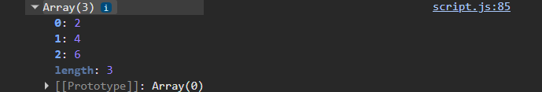

# Планировщик Расписания

**Планировщик расписания** — это веб-приложение для управления личным расписанием. Проект разработан на чистом JavaScript без сторонних фреймворков и показывает практическую работу с DOM, событиями, формами, массивами объектов, валидацией пользовательского ввода, `localStorage` и модульной структурой кода.

## Цель проекта

Цель проекта — подтвердить практические навыки программирования на JavaScript ES6+, включая создание интерактивного пользовательского интерфейса, обработку данных и организацию кода в отдельные модули. Приложение позволяет пользователю добавлять, редактировать, удалять, искать, фильтровать и сортировать события расписания.

## Основная идея приложения

Пользователь ведёт список событий: учебные занятия, рабочие встречи, личные дела и другие задачи. Каждое событие содержит название, дату, время, категорию и описание. Все события отображаются на странице в виде карточек. Данные сохраняются в браузере, поэтому после перезагрузки страницы список не исчезает.

## Основные функции проекта

- **Добавление события** через форму на главной странице.
- **Валидация формы**: проверяется название, дата, время и категория.
- **Динамическое отображение списка** событий на странице.
- **Редактирование события** через модальное окно.
- **Удаление события** с подтверждением действия.
- **Поиск** событий по названию.
- **Фильтрация** событий по категории.
- **Сортировка** событий по дате или названию.
- **Сохранение данных** в `localStorage`.
- **Адаптивный интерфейс**, который удобно использовать на компьютере и мобильных устройствах.

## Используемые технологии

- **HTML5** — структура страницы.
- **CSS3** — внешний вид, сетка, адаптивность, кнопки, карточки и модальное окно.
- **JavaScript ES6+** — логика приложения.
- **DOM API** — создание, изменение и удаление элементов страницы.
- **Events API** — обработка кликов, ввода текста, отправки форм и изменений фильтров.
- **localStorage** — хранение событий в браузере.
- **JavaScript Modules** — разделение кода на отдельные файлы.

## Что за что отвечает

### `index.html`

Главный HTML-файл проекта. В нём находится основная разметка страницы:

- заголовок приложения;
- форма добавления события;
- поля для названия, даты, времени, категории и описания;
- блок поиска, фильтрации и сортировки;
- контейнер для списка событий;
- модальное окно для редактирования события;
- подключение CSS-файла и JavaScript-модуля `app.js`.

Этот файл отвечает за базовую структуру интерфейса, но не содержит основную логику приложения.

### `css/style.css`

Файл со стилями приложения. Он отвечает за внешний вид проекта:

- оформление страницы;
- расположение блоков;
- стили формы;
- оформление карточек событий;
- стили кнопок;
- внешний вид ошибок валидации;
- оформление модального окна;
- адаптивность для разных размеров экрана.

Благодаря этому файлу приложение выглядит аккуратно и удобно для пользователя.

### `js/app.js`

Главная точка входа в JavaScript-часть проекта. Этот файл запускается первым.

Он выполняет две основные задачи:

1. Загружает сохранённые события через функцию `loadEvents()` из файла `data.js`.
2. Передаёт эти события в функцию `initEvents()` из файла `events.js`, чтобы запустить работу приложения.

Файл небольшой, но важный, потому что он связывает загрузку данных и основную логику приложения.

### `js/data.js`

Файл отвечает за работу с данными и `localStorage`.

В нём находятся:

- ключ `STORAGE_KEY`, по которому события хранятся в браузере;
- массив `defaultEvents` с начальными примерами событий;
- функция `loadEvents()`, которая загружает события из `localStorage`;
- функция `saveEvents(events)`, которая сохраняет массив событий в `localStorage`.

Если пользователь впервые открывает приложение, загружаются стандартные события. Если события уже были сохранены, приложение берёт их из памяти браузера.

### `js/dom.js`

Файл отвечает за работу с DOM-элементами и отображение данных на странице.

В нём находится объект `elements`, где собраны ссылки на основные элементы страницы: формы, поля ввода, список событий, фильтры, кнопки и модальное окно.

Также в файле есть:

- `renderEvents(events)` — очищает список и заново отображает карточки событий;
- `openEditModal(event)` — открывает модальное окно и заполняет его данными выбранного события;
- `closeEditModal()` — закрывает модальное окно;
- вспомогательные функции для форматирования даты и отображения количества событий.

Этот файл нужен, чтобы отделить работу с интерфейсом от бизнес-логики.

### `js/events.js`

Главный файл логики приложения. Он отвечает за действия пользователя и изменение массива событий.

В этом файле реализованы:

- инициализация приложения;
- добавление обработчиков событий;
- добавление нового события;
- редактирование существующего события;
- удаление события;
- обработка кликов по кнопкам в карточках;
- поиск по названию;
- фильтрация по категории;
- сортировка по дате или названию;
- обновление отображения после любого изменения.

Основной массив событий хранится в переменной `events`. Когда пользователь добавляет, изменяет или удаляет событие, массив обновляется, сохраняется в `localStorage`, а интерфейс перерисовывается.

### `js/validation.js`

Файл отвечает за проверку пользовательского ввода.

В нём находятся функции:

- `validateEvent(event)` — проверяет, правильно ли заполнены поля события;
- `showErrors(errors, errorElements)` — показывает сообщения об ошибках возле нужных полей;
- `clearErrors(errorElements)` — очищает старые ошибки.

Проверяются следующие условия:

- название не должно быть пустым;
- название должно содержать минимум 3 символа;
- дата должна быть выбрана;
- время должно быть выбрано;
- категория должна быть выбрана.

Если данные введены неправильно, событие не добавляется и не сохраняется.

## Как работает приложение в целом

1. Пользователь открывает `index.html`.
2. Файл `app.js` загружает данные из `localStorage` через `data.js`.
3. Затем запускается `initEvents()` из `events.js`.
4. На элементы страницы добавляются обработчики событий.
5. Список событий отображается через `renderEvents()` из `dom.js`.
6. Когда пользователь добавляет, редактирует или удаляет событие, массив событий обновляется.
7. После изменения данные сохраняются в `localStorage`.
8. Интерфейс обновляется и показывает актуальный список событий.

## Работа с DOM

В проекте активно используется DOM:

- элементы страницы выбираются через `document.querySelector()`;
- список событий создаётся динамически через `document.createElement()`;
- карточки событий добавляются в контейнер через `append()`;
- содержимое списка очищается через `innerHTML`;
- классы добавляются и удаляются через `classList`;
- данные события передаются через `dataset`.

Это показывает умение создавать интерактивную страницу без фреймворков.

## Работа с событиями

В приложении используются разные обработчики событий:

- `submit` — для добавления и редактирования события;
- `click` — для удаления, редактирования и закрытия модального окна;
- `input` — для поиска события по названию;
- `change` — для фильтрации и сортировки.

Обработчики позволяют приложению реагировать на действия пользователя без перезагрузки страницы.

## Работа с массивом объектов

Каждое событие хранится как объект примерно такого вида:

```js
{
  id: 'unique-id',
  title: 'Лекция по JavaScript',
  date: '2026-05-22',
  time: '10:00',
  category: 'Учёба',
  description: 'Повторить DOM, события и модули.'
}
```

Массив событий используется для:

- отображения всех карточек;
- добавления новых объектов через `push()`;
- удаления объектов через `filter()`;
- редактирования объектов через `map()`;
- поиска и фильтрации через `filter()`;
- сортировки через `sort()`.

## Валидация пользовательского ввода

Перед добавлением или сохранением события данные проверяются. Если пользователь оставляет обязательное поле пустым, возле поля появляется понятное сообщение об ошибке. Это улучшает пользовательский опыт и защищает приложение от некорректных данных.

## Хранение данных

Для хранения используется `localStorage`. Это встроенное хранилище браузера. Данные сохраняются в виде JSON-строки.

При сохранении используется `JSON.stringify()`, а при загрузке — `JSON.parse()`. Благодаря этому события остаются на странице даже после перезагрузки браузера.

## Интерактивные элементы

В проекте есть несколько интерактивных элементов:

- форма добавления события;
- живой поиск;
- фильтр по категории;
- сортировка;
- модальное окно редактирования;
- кнопки удаления и редактирования;
- подтверждение перед удалением.

Эти элементы делают приложение удобным и соответствуют требованиям проекта.

## Установка и запуск

3. Запустите файл `index.html` в Visual Studio Code через расширени Live Server


## Пример использования

1. Пользователь вводит название события, например `Экзамен по JavaScript`.
2. Выбирает дату и время.
3. Выбирает категорию, например `Учёба`.
4. При необходимости добавляет описание.
5. Нажимает кнопку добавления.
6. Событие появляется в списке.
7. Пользователь может найти событие через поиск, отфильтровать по категории или отсортировать список.
8. При необходимости событие можно отредактировать или удалить.



## Соответствие требованиям задания

| Требование | Где реализовано |
|---|---|
| Работа с DOM | `dom.js`, динамическое создание карточек событий |
| Обработчики событий | `events.js` |
| Валидация ввода | `validation.js` |
| Работа с массивом объектов | `events.js`, массив `events` |
| Фильтрация, сортировка, поиск | `events.js`, функция `updateView()` |
| Адаптивный интерфейс | `css/style.css` |
| ES6+ синтаксис | `import/export`, стрелочные функции, `const/let`, spread-оператор |
| Модульная структура | папка `js/` с отдельными файлами |
| README-документация | `README.md` |
| Интерактивные элементы | модальное окно, поиск, фильтр, сортировка |

## Возможности для дальнейшего улучшения

В будущем проект можно расширить:

- добавить выбор приоритета события;
- добавить drag-and-drop для изменения порядка событий;
- добавить календарный вид;
- добавить тёмную тему;
- подключить внешний API;
- добавить экспорт событий в файл.

## Автор

Иванчогло Иван(IA2504)

## Использованные источники

- MDN Web Docs — https://developer.mozilla.org/
- JavaScript.info — https://javascript.info/
- W3Schools — https://www.w3schools.com/

## Вывод

В результате был создан интерактивный планировщик расписания на Vanilla JavaScript. Проект демонстрирует основные навыки работы с современным JavaScript: модульную структуру, обработку событий, работу с DOM, валидацию форм, обработку массива объектов, фильтрацию, сортировку, поиск и сохранение данных в браузере.
